# Two-Tier File Upload & Display with Amazon EC2, S3, and IAM Roles

**Student:** Bansari Yadav  
**NetID:** byadav1  
**Course:** Cloud Computing

## 1. Project Overview

This project demonstrates a two-tier file upload and display system using Amazon Web Services (AWS). The system consists of two separate EC2 instances: one for uploading text files and another for viewing the uploaded content.

Instead of communicating directly, both applications use Amazon S3 as shared storage. The Uploader saves the content of a text file to an S3 object named `shared.txt`, and the Viewer retrieves that content and displays it in a web browser.

This lab provided hands-on experience with EC2 instances, S3 buckets, IAM roles, launch templates, deployment scripts, and application testing.

## 2. AWS Services and Technologies Used

- **Amazon EC2:** Hosts the Uploader and Viewer applications.
- **Amazon S3:** Stores the shared text content.
- **AWS IAM:** Controls permissions for uploading and viewing files.
- **EC2 Launch Templates:** Store instance configurations and startup instructions.
- **EC2 User Data:** Automatically installs and starts the applications.
- **Node.js:** Provides the JavaScript runtime for both applications.
- **Express.js:** Handles web requests and application routing.
- **Bash Scripts:** Automate deployment and cleanup operations.

## 3. System Architecture

```text
                     User / Web Browser
                              |
                  -----------------------
                  |                     |
                  v                     v
             Uploader EC2          Viewer EC2
                  |                     ^
                  |                     |
             S3 PutObject          S3 GetObject
                  |                     |
                  v                     |
                  Amazon S3 Bucket ------
                     shared.txt
```

The Uploader and Viewer run independently. Amazon S3 acts as the shared storage layer, allowing one application to write content and the other to read it.

## 4. Project Folder Structure

```text
EC2_S3_TwoTier_FileUpload_Display/
|
|-- lab03/
|   |-- uploader-app/
|   |-- viewer-app/
|
|-- .env.example
|-- .gitignore
|-- create_app_stack.sh
|-- delete_app_stack.sh
|-- README.md
|
|-- SS1_Folder_Structure.png
|-- SS2_Upload_Success.png
|-- SS3_File_Too_Large.png
|-- SS4_Invalid_File.png
|-- SS5_Viewer.png
|-- SS7_Launch_Templates.png
|-- SS8_Template_Versions.png
|-- SS9A_Uploader_IAM.png
|-- SS9B_Viewer_IAM.png
|-- SS10_EC2_Deployment.png
|-- SS11_Cleanup.png
```

## 5. Project Implementation

### Step 1 — Prepare the Application Files

I started by organizing the project into two application folders: Uploader and Viewer.

The Uploader application handles text file uploads, while the Viewer application retrieves and displays the content stored in S3.

The separate folders made it easier to manage and configure each application.

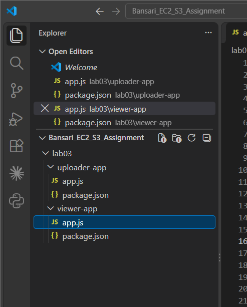

### Step 2 — Configure Amazon S3

Amazon S3 was used as the shared storage service between the two applications.

The Uploader stores the uploaded text as an object named `shared.txt`. When the Viewer receives a request, it reads the object from S3 and displays the content.

This design allows both applications to exchange data without requiring direct communication between EC2 instances.

### Step 3 — Configure IAM Roles and Permissions

Separate IAM roles were used for the Uploader and Viewer instances.

Each role was assigned only the permissions necessary for its application.

#### Uploader IAM Role

The Uploader role allows the application to write content to the shared S3 object.

**Required permission:**
- `s3:PutObject` on the shared object.

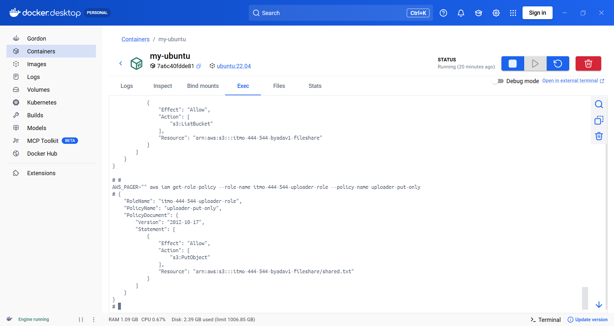

#### Viewer IAM Role

The Viewer role allows the application to retrieve the file stored in S3.

**Required permissions:**
- `s3:GetObject` on the shared object.
- `s3:ListBucket` on the associated bucket.

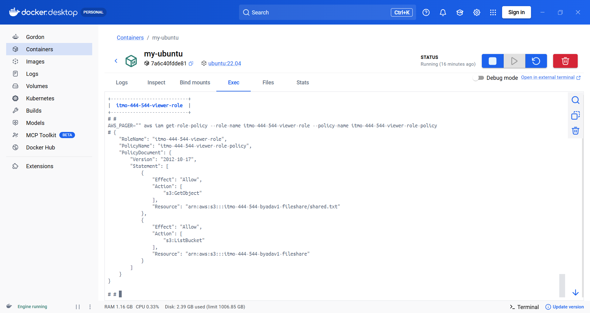

Using different IAM roles helped me understand the principle of least privilege, where each component receives only the access it needs.

### Step 4 — Create EC2 Launch Templates

I created separate launch templates for the Uploader and Viewer EC2 instances.

The launch templates define how the instances should be launched and include user-data scripts to configure the applications automatically.

This reduces the amount of manual setup required after launching an instance.

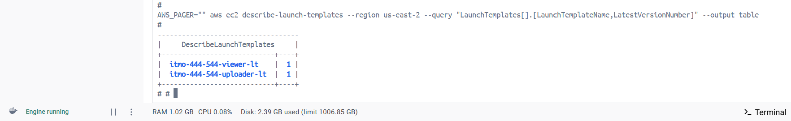

I also reviewed the different versions of the Uploader launch template to understand how changes to an instance configuration can be managed.

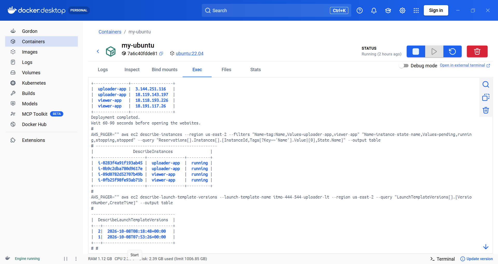

### Step 5 — Deploy the Application

The `create_app_stack.sh` script was used to create the required AWS resources and launch the application instances.

The script provisions resources such as the S3 bucket, IAM roles, instance profiles, launch templates, and EC2 instances.

After deployment, the script displays the public IP addresses that can be used to access the applications.

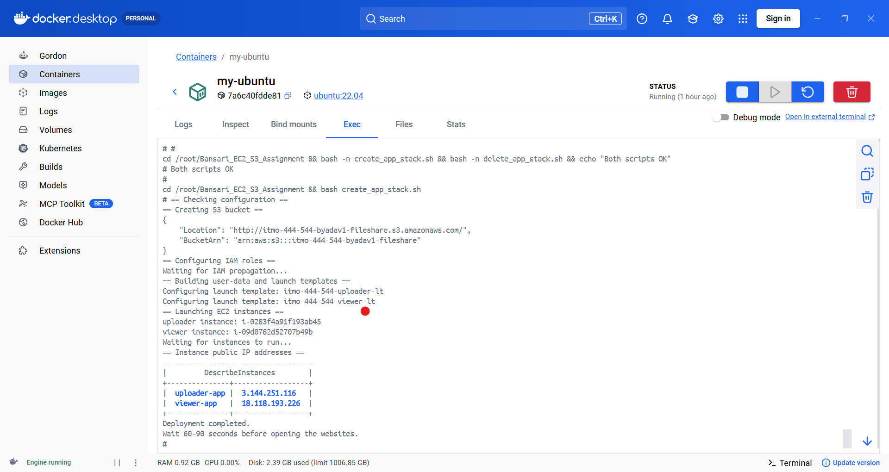

### Step 6 — Test the Uploader Application

After deployment, I tested the Uploader application with different types of files to verify that the upload restrictions were working correctly.

#### Test 1 — Successful Text File Upload

I uploaded a valid `.txt` file through the Uploader application.

The application accepted the file and saved its content to Amazon S3.

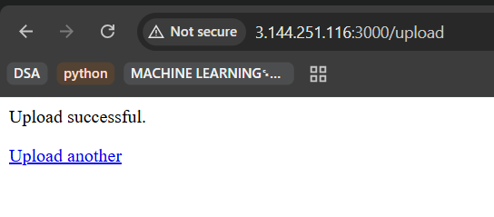

#### Test 2 — File Size Validation

Next, I attempted to upload a file larger than the allowed 1 MB limit.

The application rejected the upload, confirming that the file size validation was functioning.

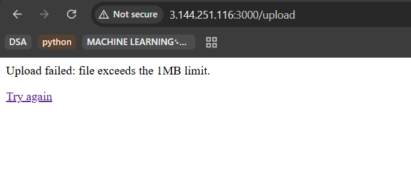

#### Test 3 — File Type Validation

I also tested the application by attempting to upload a file that did not have a `.txt` extension.

The application rejected the unsupported file type.

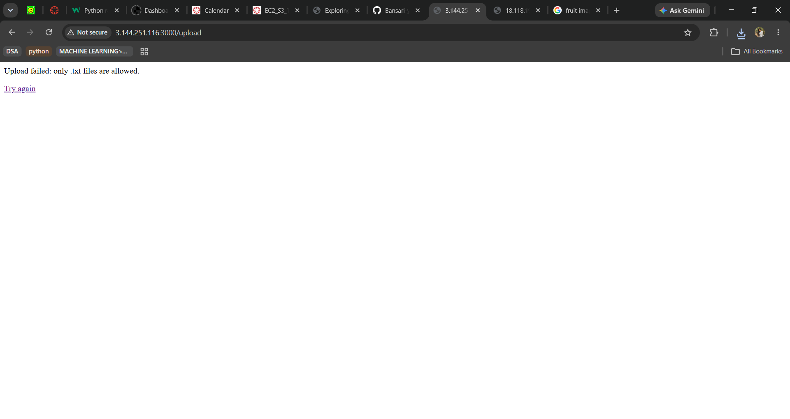

These tests demonstrated how the Uploader handles valid inputs and rejects files that do not meet the requirements.

### Step 7 — Verify the Viewer Application

After uploading a text file, I opened the Viewer application.

The Viewer retrieved the content stored in the S3 object and displayed it in the browser.

This confirmed that the two EC2 applications could use the same S3 object for storing and retrieving data.

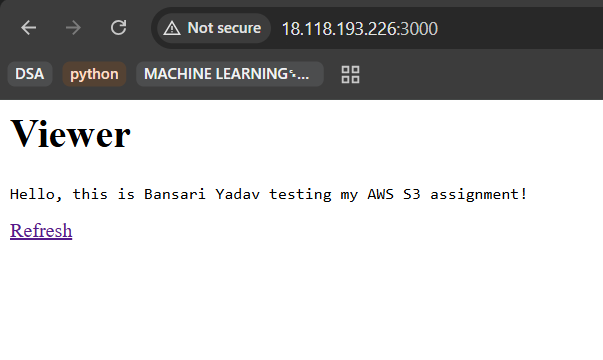

**Additional verification:** The assignment also includes checking that the Viewer displays updated content after another upload. The separate screenshot for this test was not available in the collected evidence.

### Step 8 — Clean Up AWS Resources

Once testing was completed, I used the `delete_app_stack.sh` script to clean up the resources created for this lab.

This step is important because unused AWS resources can continue generating charges.

The cleanup script was designed to remove the instances and other associated project resources.

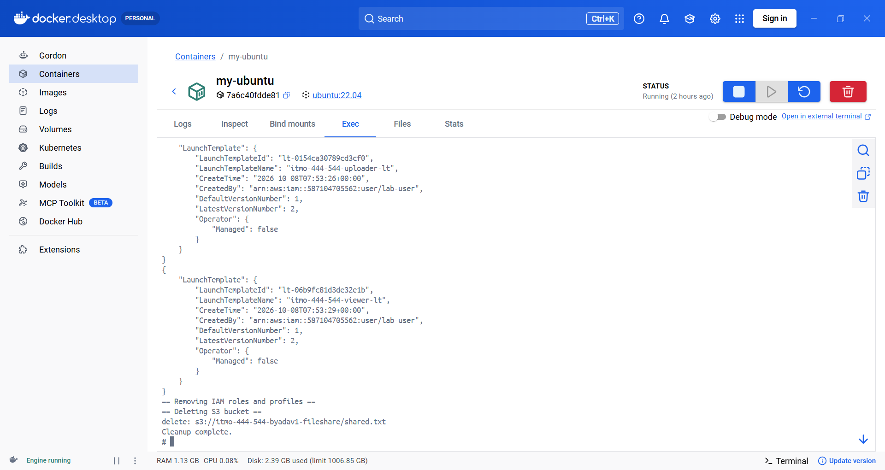

## 6. Screenshot Evidence Summary

The following table organizes the screenshots captured during the lab.

| Screenshot | Description | Evidence |
|---|---|---|
| SS1 | Application folder structure | [View](SS1_Folder_Structure.png) |
| SS2 | Successful text file upload | [View](SS2_Upload_Success.png) |
| SS3 | File larger than 1 MB rejected | [View](SS3_File_Too_Large.png) |
| SS4 | Invalid file type rejected | [View](SS4_Invalid_File.png) |
| SS5 | Viewer displaying stored content | [View](SS5_Viewer.png) |
| SS6 | Viewer displaying updated content | Not available |
| SS7 | EC2 launch templates | [View](SS7_Launch_Templates.png) |
| SS8 | Launch template versions | [View](SS8_Template_Versions.png) |
| SS9A | Uploader IAM policy | [View](SS9A_Uploader_IAM.png) |
| SS9B | Viewer IAM policy | [View](SS9B_Viewer_IAM.png) |
| SS10 | EC2 deployment output | [View](SS10_EC2_Deployment.png) |
| SS11 | AWS cleanup output | [View](SS11_Cleanup.png) |

## 7. Why Use Separate IAM Roles?

The Uploader and Viewer applications perform different tasks, so they do not need identical permissions.

The Uploader only needs permission to upload content, whereas the Viewer needs permission to read stored content.

Assigning separate roles prevents unnecessary access and follows the AWS principle of least privilege.

It also avoids storing permanent AWS access keys directly in the application code.

## 8. Why Use EC2 User Data?

EC2 user-data scripts automate the setup process when an instance starts.

In this project, the application code and startup instructions were included in the launch-template user data.

This approach allows the EC2 instances to recreate the applications during startup without manually installing the software each time.

It also reduces the need for a separate code-download process.

## 9. Security Considerations

The project demonstrates several security practices:

- Separate IAM roles for each EC2 application.
- Restricted S3 access based on application responsibilities.
- IAM instance profiles rather than hardcoded AWS credentials.
- Environment configuration placeholders in `.env.example`.
- Sensitive files excluded using `.gitignore`.
- Resource cleanup after completing the lab.

Actual AWS credentials, secret keys, and private environment files should not be committed to a public repository.

## 10. Challenges and Learning Outcomes

Working on this project helped me understand how several AWS services can be connected to create a functioning application.

One important part was configuring the IAM permissions correctly. The Uploader and Viewer needed different permissions even though they accessed the same S3 bucket.

Another useful part was testing the upload restrictions. By trying valid files, oversized files, and unsupported file formats, I was able to check how the application handled different scenarios.

I also learned how launch templates and user-data scripts simplify EC2 deployment, and why cleaning up AWS resources is important after testing.

## 11. Conclusion

This project demonstrates a simple two-tier cloud application using Amazon EC2, Amazon S3, and AWS IAM.

The Uploader and Viewer run on separate EC2 instances and use Amazon S3 as their shared storage layer.

Through this lab, I gained practical experience with application deployment, IAM permissions, file validation, launch templates, shell scripts, and AWS resource cleanup.

The project provided a clearer understanding of how independent cloud application components can work together through shared services.

## 12. Project Files

- [Application Code](lab03/)
- [AWS Deployment Script](create_app_stack.sh)
- [AWS Cleanup Script](delete_app_stack.sh)
- [Environment Configuration Example](.env.example)
- [Git Ignore Configuration](.gitignore)

---

**Course:** Cloud Computing  
**Project:** Two-Tier File Upload & Display using EC2, S3, and IAM Roles  
**Student:** Bansari Yadav

**Note:** This repository documents the completed lab. AWS resources were cleaned up after testing.
